# T1A2 - Portfolio Assignment
 
 

<!-- Table of Contents -->
## Contents
    
* [Links](#links)
* [Purpose](#purpose)
* [Target Audience](#target-audience)
* [Functionality / Features](#functionality--features)
* [Sitemap](#sitemap)
* [Screenshots](#screenshots)
* [Tech stack](#tech-stack)

 

<!-- Links -->
## Links
<a href="https://sam-owen-portfolio.netlify.app/">Portfolio website</a> 
<a href="https://github.com/StructuredTrading/T1A2---Portfolio">Github repository</a> 
<a href="https://youtu.be/kcJoyz_5i3E">Presentation video</a> 

 

<!-- Purpose -->
## Purpose
The purpose of this is to create a portfolio website which presents me as a dev and IT professional. The purpose is to provide an online portfolio that provides information about me, my skills, interests, professional knowledge and a showcase of my work.

 

<!-- Target audience -->
## Target Audience
The target audience for the portfolio website is an employer looking to engage a dev and/or IT professional.

 

<!-- Functionality / Features -->
## Functionality / Features
Responsive web design with auto-sizing to fit the current display output. Navigation links in header to quickly switch between website pages.  
Navbar has a JavaScript hamburger menu when screen size is smaller eg mobile / tablet. When viewed on a laptop / desktop or larger screen sizes, navbar features readily accessable buttons. 

 

<!-- Sitemap -->
## Sitemap
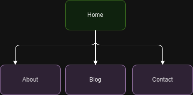

 

<!-- Screenshots -->
## Screenshots
 
<h3 align="center">Wireframes</h3>  

<!-- Desktop view - Wireframes -->
Desktop view - Wireframe
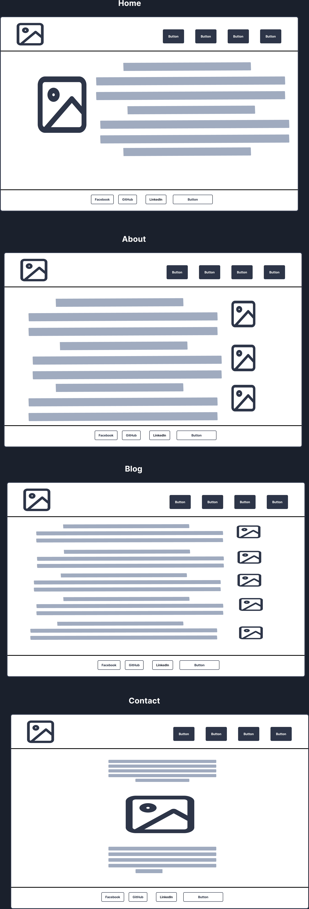 

<!-- Mob / Tablet view - Wireframes -->
Mobile / Tablet view - Wireframe
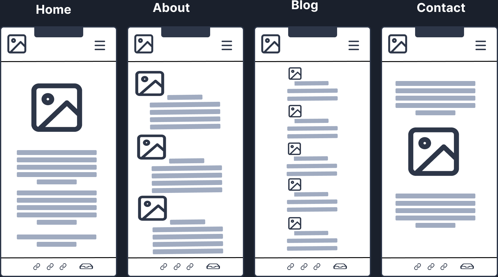 

<!-- Desktop view -->
<h3 align="center">Live Website (desktop view)</h3> 

<!-- Home -->
Desktop view - Homepage
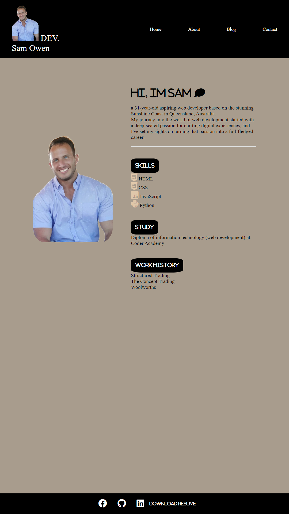  

<!-- About -->
Desktop view - About
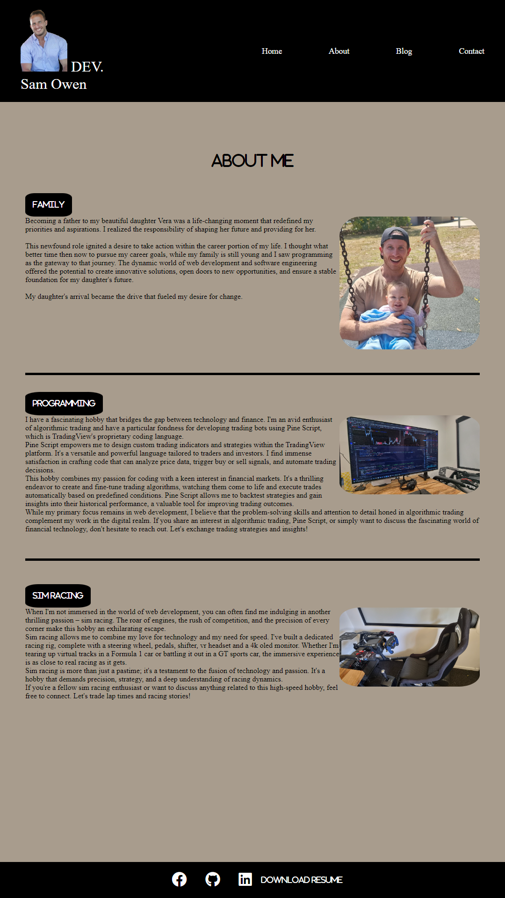  

<!-- Blog -->
Desktop view - Blog
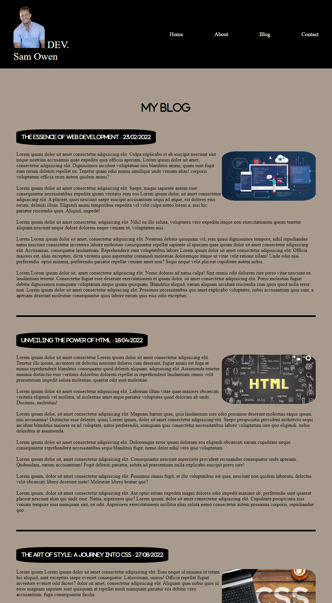  
Desktop view - Blog
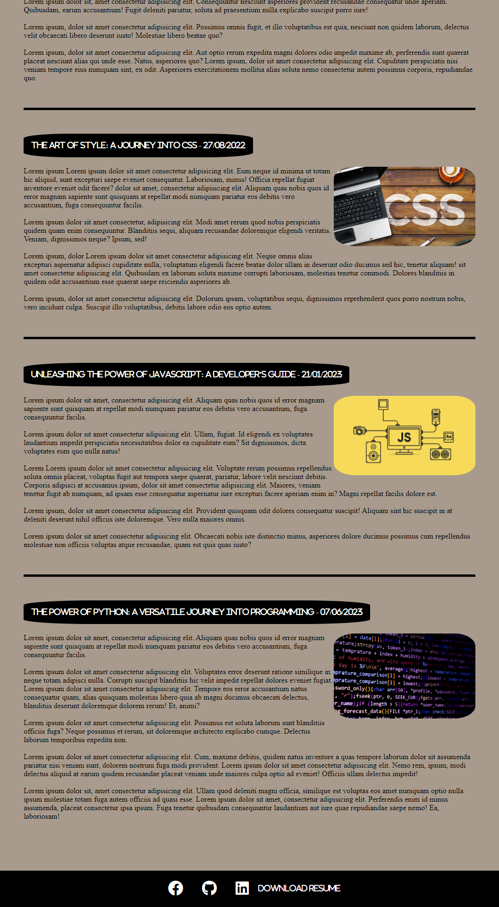  

<!-- Contact -->
Desktop view - Contact
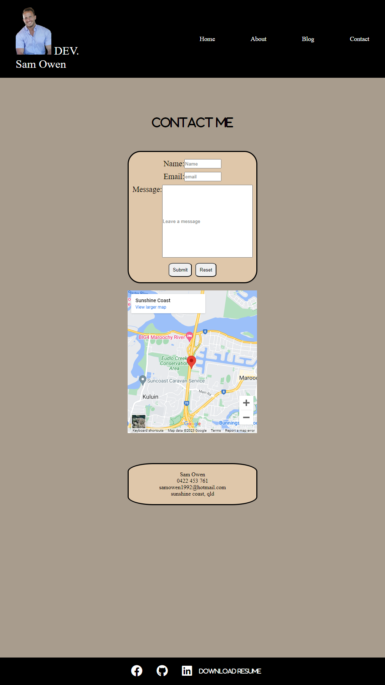  
 

<!-- Mobile / Tablet view -->
<h3 align="center">Live Website (Mobile / Tablet view)</h3> 

<!-- Home -->
Mobile / Tablet view - Homepage 
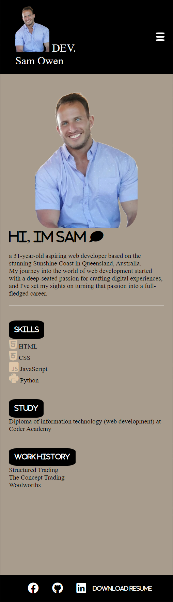  

<!-- About -->
Mobile / Tablet view - About  
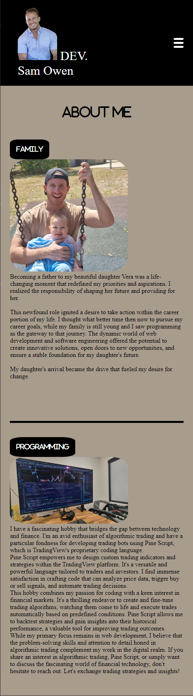  
Mobile / Tablet view - About 
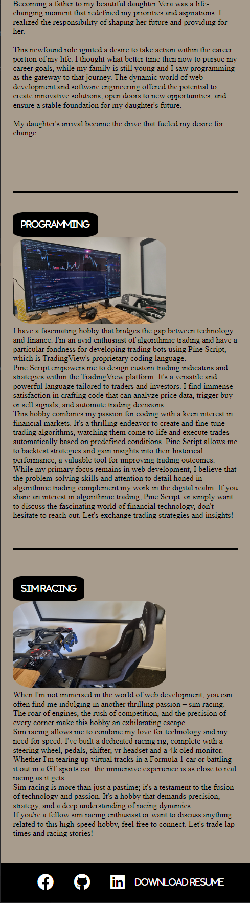  

<!-- Blog -->
Mobile / Tablet view - Blog 
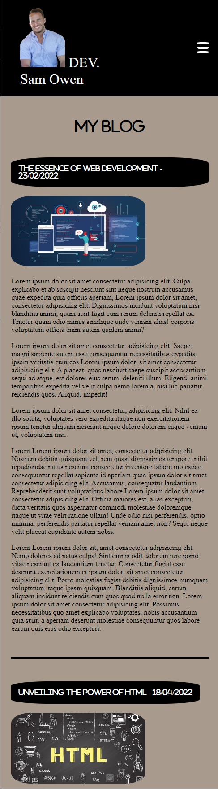  
Mobile / Tablet view - Blog 
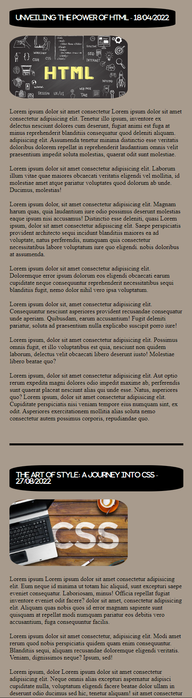  
Mobile / Tablet view - Blog 
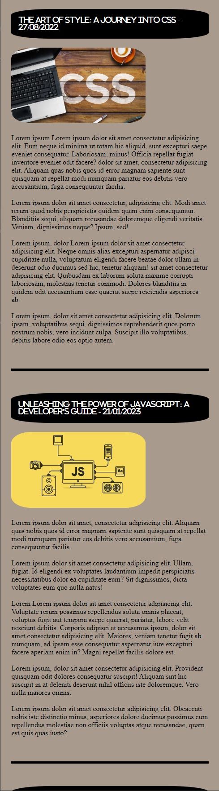  
Mobile / Tablet view - Blog 
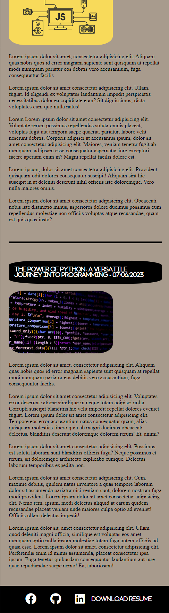  

<!-- Contact -->
Mobile / Tablet view - Contact 
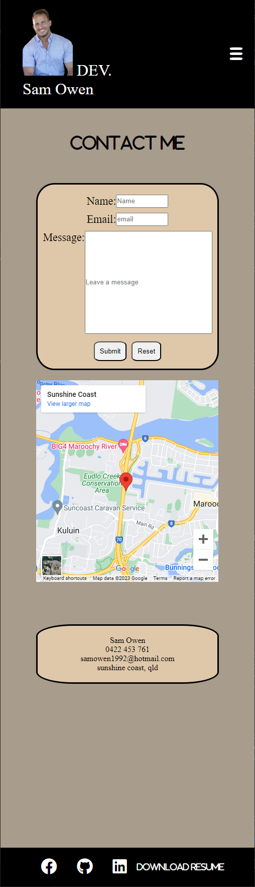  
 

## Tech stack
<ul>
    <li>HTML</li>
    <li>CSS</li>
    <li>JavaScript</li>
    <li>Github</li>
    <li>Netlify</li>
 
